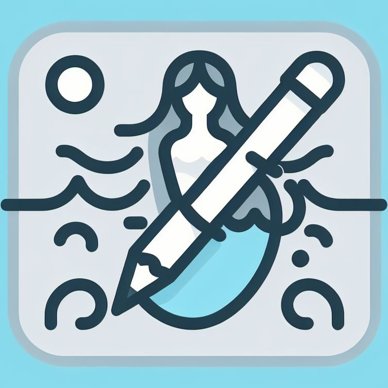

Mermaiditor is a [mermaid.js](https://mermaid.js.org/intro/) diagram editor with local storage, and organization features.

# What can you do with Mermaiditor?

- Author diagrams, which are rendered using mermaid.
- Export those diagrams as png to file or to clipboard. You can paste them directly into Word!
- Save those diagrams in Projects in browser storage
- Save and edit diagrams directly as files on your hard drive, OneDrive, DropBox, SharePoint or whatever. That way your files are safe, and multiple people can contribute to writing diagrams! For that you need a browser that supports file storage API, and only Chromium, Chrome and Edge do as of today.
- Exporting/importing projects as JSON.
- Use predetermined templates, all the diagram types supported by mermaid have a template.
- Apply themes

# How do I install it?

Mermaiditor is fully based in browser. You don't need to install it! You can just use it [here](https://cfe84.github.io/mermaiditor)! You can also deploy your own if you so choose.